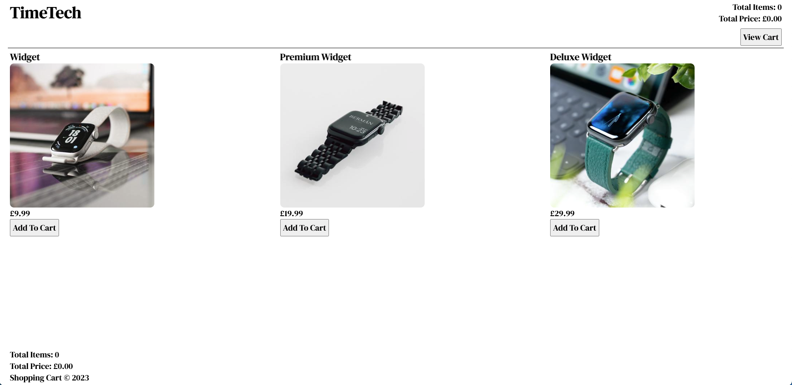
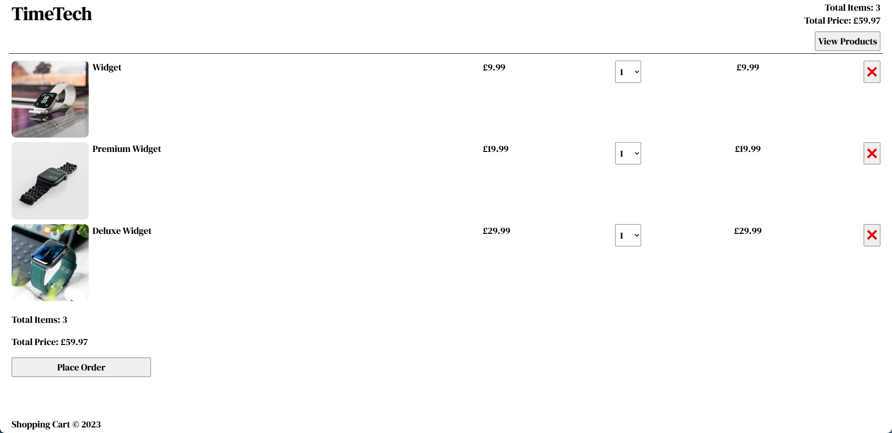

# **React TypeScript Shopping Cart**

## <ins>Summary</ins>

This is a Shopping Cart built using React with Vite, Typescript. You are able to add items to the cart, view the items in the cart, alter the quantity of the items in the cart and remove items from the cart.

Please note - there is no back-end configured to handle the placing of the order. This is just front-end only however if you do click "Place Order", you will be presented with a "Thank you for your order" message.

The purpose of this project was to gain an understanding of TypeScript and widen my knowledge of React by using it with TypeScript.

---

## <ins>Screenshots</ins>

---

## <ins>Tech Stack</ins>

- React
- TypeScript
- Vite

---

## <ins>Local Setup</ins>

1. To clone the repo, open up your terminal and run `git clone https://github.com/mandeep-s1ngh/react-typescript-shopping-cart.git` - once you have it cloned, move the folder to your usual directory for projects (if necessary).

2. You can then open up the folder in your code editor of choice and run `npm install` to install all the dependencies.

3. Then run `npm run dev`. This will start the app and keep it running in the background whilst you make any changes.
